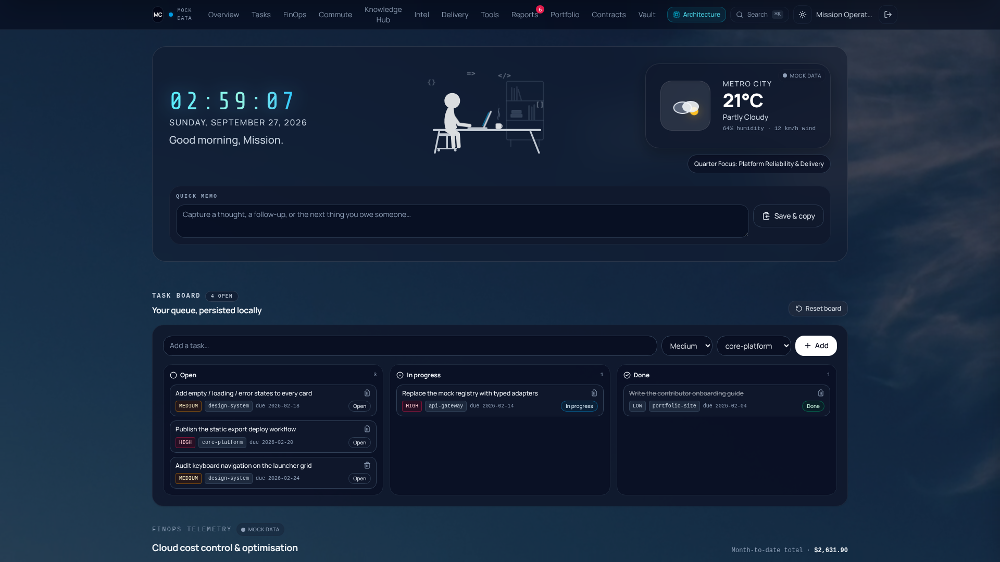

# Developer Mission Control (OSS Portal Template)

A clean, decoupled, and production-grade developer control center built with **Next.js 16 (App Router)**, **React 19**, **TypeScript 5.7**, **Tailwind CSS v4**, and shadcn-style UI primitives.

Designed as a lightweight, zero-maintenance frontend shell that can be deployed to any static host (AWS S3 + CloudFront, Cloudflare Pages, Vercel, GitHub Pages, or plain Nginx) without requiring a backend runtime, a database, or a single API key.



---

## Table of Contents

- [Key Features](#key-features)
- [Quick Start](#quick-start)
- [How to Customize (Make It Yours)](#how-to-customize-make-it-yours)
- [Project Structure](#project-structure)
- [Deployment Recipes](#deployment-recipes)
- [Security Notes](#security-notes)
- [Author & Connect](#author--connect)
- [License](#license)

---

## Key Features

- **Decoupled architecture:** 100% client-driven with typed mock adapters. Runs out-of-the-box with zero database or API setup.
- **Static export ready:** Pre-configured with `output: 'export'` in `next.config.mjs` for sub-second static loads and near-zero hosting costs.
- **Developer telemetry:** Built-in sprint delivery tracking, task board, workspace app launcher, intelligence feed, reports, FinOps spend telemetry, contracts ledger, and infrastructure status widgets.
- **Config-driven customization:** Brand, timezone, telemetry, and mock datasets are localized into two straightforward config files.
- **Pure demo secret vault:** Safe visual UI demo component without sensitive credential leakage risks.

### Feature Tour

Rows are listed in the dashboard block order, which the sticky `TopNav` mirrors
one-for-one (`components/dashboard/authorized-dashboard.tsx` is the single source
of truth for the layout; `components/dashboard/top-nav.tsx` renders it with
progressive `md`/`lg`/`xl` tiers).

| # | Section | What it shows | Mock source |
| --- | --- | --- | --- |
| 1 | Hero cover | Live clock, greeting, weather card, local quick memo | `mockWeather`, `siteConfig` |
| 2 | Task board | Three-column queue with local persistence | `mockTasks` |
| 3 | FinOps | Month-to-date cloud spend with trend deltas | `mockFinopsMetrics` |
| 4 | Commute telemetry | Travel hub — one direction and one leg at a time, fastest service crowned and pinned to slot 1, local 1 Hz countdown | `mockCommute` |
| 5 | Knowledge hub | Note capture, tag select, keyword search, copy-to-clipboard | `mockKnowledgeNotes` |
| 6 | Intelligence feed | Category tabs, severity badges, read/unread, save to notes | `mockIntelligence` |
| 7 | Delivery board | Sprint switcher, project filters, status cycling, KPI rail | `mockSprintCatalog` |
| 8 | Tool launcher | Category filters, drag & drop reorder, lock, reset | `toolCatalog` |
| 9 | Reports | Top-8 / all view, read state, drawer with markdown body | `mockReports` |
| 10 | Portfolio & cash flow | Liquid assets, net-worth milestones, budget categories | `mockWealthTelemetry`, `mockBudgetTelemetry` |
| 11 | Contracts | Renewal urgency, cancelled-service ledger, draft drawer | `mockContracts` |
| 12 | Secret vault | **UI demo only** — masked placeholders, reveal & copy | `mockVaultEntries` |

Also included: ⌘K command palette, architecture modal, dark/light theme with persistence, PWA manifest, custom cursor, animated weather icons, and a build-id cache kill-switch for clean CDN releases.

---

## Quick Start

### 1. Clone & Install

```bash
git clone https://github.com/kenzikenzili-build/developer-portal-template.git
cd developer-portal-template
npm install
```

Node.js 20+ is required (Next.js 16 baseline).

### 2. Run Local Development

For standard environments:

```bash
npm run dev
```

You are signed in automatically with a local mock session, so the dashboard renders immediately. Use the sign-out button in the top nav to visit `/login` and start the mock session again.

If developing inside resource-constrained Docker / WebContainer environments:

```bash
npm run dev:webpack
```

`next dev` fails with `OS file watch limit reached` when `fs.inotify.max_user_watches` is set too low — common in containers and CI. `npm run dev:webpack` is more tolerant because webpack polling needs fewer watchers. Alternatively raise the host limit:

```bash
sudo sysctl fs.inotify.max_user_watches=524288
```

Open [http://localhost:3000](http://localhost:3000) to access your mission control. The production build is unaffected by the watch-limit issue.

### 3. Available Scripts

| Script | Description |
| --- | --- |
| `npm run dev` | Start the dev server (Turbopack) |
| `npm run dev:webpack` | Dev server on the webpack pipeline (containers with low file-watch limits) |
| `npm run build` | Type-check and export the static site to `out/` |
| `npm run start` | Serve a production build with `next start` |
| `npm run export` | Alias of `build` for static hosting pipelines |

---

## How to Customize (Make It Yours)

This template is designed to be forked and customized in under 10 minutes.

### 1. Site Branding & Preferences

Edit `config/site.ts` to adjust:

- Workspace name, short name, monogram, tagline, footer label, and metadata.
- Default locale and timezone used by every clock / date formatter.
- The mock `operator` identity shown while no auth provider is wired up.
- `storagePrefix` — the prefix applied to every persisted localStorage key, so forks never collide.

### 2. Updating Telemetry & Mock Data

All widget data lives in `config/mockData.ts`:

- **Sprint & Delivery Board:** Update ongoing roadmap milestones, sprint catalog, and task progress (`mockSprintCatalog`, `mockTasks`).
- **Travel hub:** Each direction (`morning` / `evening`) owns two legs, and every boardable service lives in that leg's `options` array — the lowest `etaMinutes` in the selected leg is crowned and pinned automatically (`mockCommute`).
- **Quick Launcher:** Add or remove shortcuts to your internal tools and daily web apps (`config/toolCatalog.ts`).
- **System Metrics & Feeds:** Configure the static cards representing your infra health, intelligence items, reports, FinOps deltas, contracts, wealth, and budget telemetry.

Domain contracts and seeds live next to their sections — `config/tools.ts`, `config/reports.ts`, `config/contracts.ts`, `config/wealth.ts` — alongside the pure helpers in `lib/`. Replace the exported constants and the UI updates instantly.

### 3. Connecting to Real APIs (Bring Your Own Backend)

Every section consumes a plain typed shape and never talks to the network today. To go live:

1. Keep the exported type (for example `IntelReport`, `SprintCatalog`).
2. Fetch your payload with `useSWR` or a `useEffect`.
3. Pass the result into the same prop / context the mock previously supplied.

Optional endpoint env vars are documented in `.env.example`:

`NEXT_PUBLIC_SPRINT_ENDPOINT`, `NEXT_PUBLIC_REPORTS_ENDPOINT`, `NEXT_PUBLIC_INTELLIGENCE_ENDPOINT`, `NEXT_PUBLIC_FINOPS_ENDPOINT`, `NEXT_PUBLIC_TASKS_ENDPOINT`.

### 4. Replace the Auth Provider

`components/providers/workspace-auth-provider.tsx` implements the `WorkspaceAuthState` contract from `lib/auth/types.ts` and keeps a mocked session in localStorage. Swap in Auth0 / NextAuth / Cognito / Clerk / Supabase, or point it at your own session endpoint — no dashboard component changes are required.

---

## Project Structure

```
app/                     Next.js App Router (static export)
  (workspace)/           Dashboard routes + per-section anchors
  login/                 Mock sign-in seam
components/
  dashboard/             One file per dashboard section
  providers/             Theme / modal / auth providers
  ui/                    shadcn-style primitives
config/
  site.ts                Branding, timezone, storage prefix
  mockData.ts            ⭐ The entire mock data registry
  toolCatalog.ts         Generic tool launcher catalog
  tools.ts reports.ts contracts.ts wealth.ts   Domain contracts + seeds
lib/                     Pure helpers (sprint, budget, wealth, news, storage)
hooks/                   Sprint catalog + report read-state hooks
public/                  Icons, videos, placeholder art
```

---

## Deployment Recipes

### Static Build

Export every route to a clean static distribution directory (`out/`):

```bash
npm run build
```

`next.config.mjs` sets `output: 'export'` and `images.unoptimized: true`, which disables Route Handlers, middleware, and server actions. That is exactly why this template ships with no backend coupling.

### AWS S3 + CloudFront

```bash
npm run build
aws s3 sync out/ s3://<your-bucket> --delete
aws cloudfront create-invalidation --distribution-id <id> --paths '/*'
```

Upload the contents of `out/` directly to your S3 bucket, front it with CloudFront, and invalidate the distribution on every release.

### Vercel / Cloudflare Pages / Netlify / GitHub Pages

Connect your GitHub repository and set:

- **Build command:** `npm run build`
- **Output / publish directory:** `out`

For hosting under a sub-path (for example GitHub Pages project sites), add `basePath` to `next.config.mjs`.

### Cache-Busting Releases

`NEXT_PUBLIC_BUILD_ID` (defaults to the Git SHA in CI, otherwise a timestamp) is baked into the client bundle. When it changes, the shell purges stale Cache Storage entries and unregisters old service workers, so clients never serve a previous app shell.

---

## Security Notes

- **The vault card is a UI demo.** Its values are obvious placeholders. Never ship real credentials in a client bundle — proxy secret reads through your own backend and return masked values only.
- Mock sessions live in `localStorage` for convenience. Replace the provider before exposing anything real.
- There are no API routes, middleware, or server actions in this repository, so `output: 'export'` stays valid — keep it that way if you want to retain static hosting.
- No personal or project-specific data is checked in; `.env.example` documents optional endpoints only.

---

## Tech Stack

Next.js 16 (App Router) · React 19 · TypeScript 5.7 · Tailwind CSS v4 · next-themes · framer-motion · lucide-react · cmdk · @dnd-kit · Base UI

---

## Author & Connect

Crafted by **KZ** ([@kenzikenzili-build](https://github.com/kenzikenzili-build))

*Cloud Solutions Architect & Systems Builder*

Specializing in cost-optimized serverless architectures, decoupled frontend systems, and developer automation.

- **Discussions & Feedback:** Open an [Issue](https://github.com/kenzikenzili-build/developer-portal-template/issues) or start a GitHub Discussion on this repository.
- **Consulting & Projects:** Open for architectural consulting, high-impact implementation opportunities, and technical advisory.
- **Reach out:** Connect via GitHub or reach out directly at [kenzikenzili@gmail.com](mailto:kenzikenzili@gmail.com).

---

## License

This project is open-source under the [MIT License](LICENSE). Feel free to fork, adapt, and build upon it.
